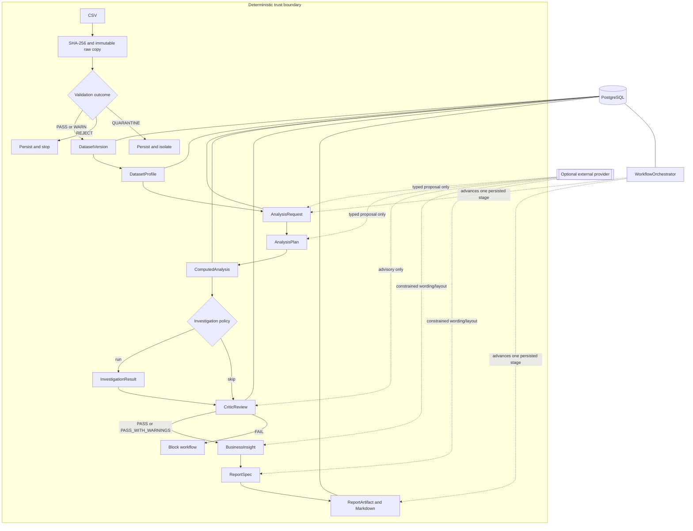
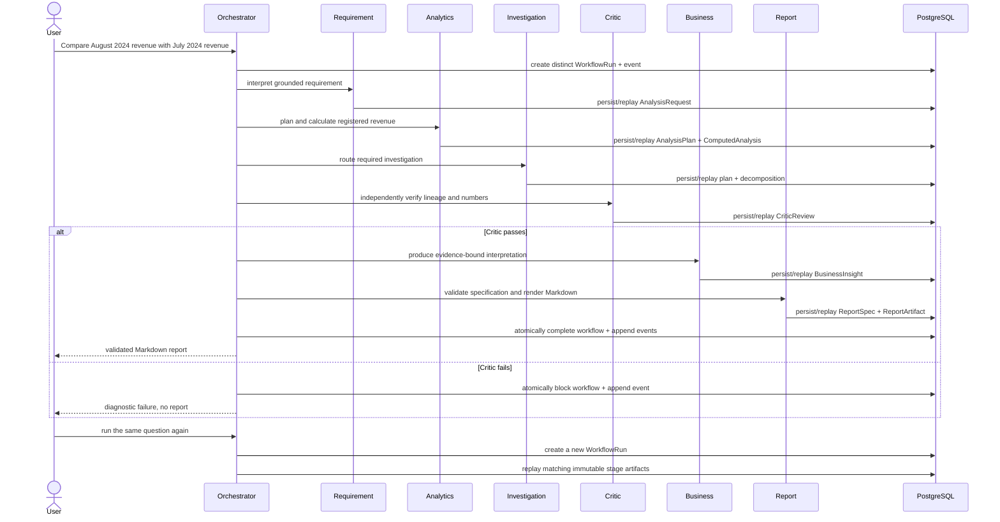

# Architecture

## Scope

The repository implements a controlled V1–V9 analytics workflow. It accepts a versioned CSV and
a constrained business question, calculates registered metrics, optionally investigates drivers,
independently critiques the evidence, and renders a Markdown report. It does not expose an API or
run autonomously.

## Components

| Component | Responsibility | Boundary |
| --- | --- | --- |
| `pipeline` | Hash, ingest, validate, and register source data | Deterministic |
| `storage` | Retain immutable raw bytes by content hash | Deterministic I/O |
| `profiling` | Produce aggregate dataset metadata | Deterministic; optional provider enrichment |
| `agents/requirement_agent.py` | Ground a question in known fields, metrics, and dates | Deterministic default; typed provider proposal optional |
| `agents/analytics_planner.py` | Create a semantically valid execution plan | Deterministic default; typed provider proposal optional |
| `agents/analytics_engine.py` | Execute registered pandas calculations | Always deterministic |
| `investigation` | Decompose changes and concentration without causal claims | Always deterministic |
| `qa` and `agents/critic_agent.py` | Recheck provenance, arithmetic, coverage, and evidence | Deterministic gate; provider advice cannot override |
| `business` | Bind factual prose to evidence IDs | Deterministic fallback; constrained provider wording optional |
| `reporting` | Validate layout specifications and render Markdown | Deterministic facts and rendering |
| `orchestration` | Persist state, route stages, retry transient failures, resume safely | Deterministic control plane |
| `database` and `migrations` | Store lineage, artifacts, snapshots, and events | PostgreSQL production target |

## Artifact and Control Flow

Every durable artifact has its own identity and provenance. A new workflow invocation is always
distinct for auditability. Its immutable stage artifacts replay when their inputs and behavior
versions match.

## Validation Gates

- `PASS`: no detected issue; analytics may proceed.
- `WARN`: non-fatal quality issue; analytics may proceed with warnings.
- `REJECT`: fatal integrity issue; analytics stops.
- `QUARANTINE`: suspicious or policy-unknown input retained for review; analytics stops.

Generic checks cover emptiness, schema, duplicates, nulls, numeric types/ranges, and dates. The
sales policy separately checks accepted regions, positive measures, order-date range, and
`revenue = quantity × unit_price` within 0.01.

## Replay and Concurrency

Source bytes are keyed by SHA-256. A unique source hash prevents duplicate pipeline runs and raw
copies. Analytical stores use versioned identity hashes and database unique constraints. They
recover from insert races by rolling back and reading the winning immutable artifact.

Workflow snapshots use compare-and-swap updates on an integer version. The snapshot update and
its stage events commit in one database transaction. A stale writer raises
`StaleWorkflowVersionError`; it cannot overwrite the winner.

## Failure Behavior

The orchestrator marks semantic and integrity failures non-retryable. Only `OperationalError`,
`OSError`, and `TimeoutError` are retryable, and retry attempts are bounded. A persisted artifact
created just before a workflow snapshot failure is safe: resume recomputes its identity, replays
that immutable artifact, and then advances the snapshot. The Critic `FAIL` state blocks business
interpretation and reporting.

## Golden Demo Sequence

